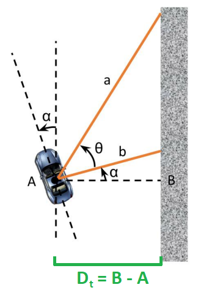
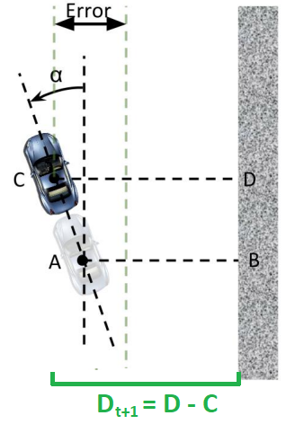

# Lab 2: Automatic Emergency Braking & Wall Following

This lab has two parts, done in the same workspace:

| Part | Package | Topic |
|---|---|---|
| **2a** | `safety_node` | Automatic Emergency Braking (AEB) via instantaneous time to collision |
| **2b** | `wall_follow` | Wall following with a PID controller |

Both parts are built and run inside the same ROS 2 workspace, `sim_ws`, which is also where the simulator is. For installing the simulator, follow the instructions in the [this repo](https://github.com/f1tenth-cmu/f1tenth_gym_ros). Your two packages should be in `sim_ws/src/` alongside `f1tenth_gym_ros`:

```
sim_ws/
└── src/
    ├── f1tenth_gym_ros/   # the simulator (from the sim repo, not this one)
    ├── safety_node/       # Part 2a
    └── wall_follow/       # Part 2b
```

## Learning Goals

- Using the `LaserScan` message in ROS 2
- Instantaneous Time to Collision (iTTC)
- Safety critical systems
- PID Controllers
- Driving the car autonomously via Wall Following


# Part 2a: Automatic Emergency Braking

## I. Overview

The goal of part 2a is to develop a safety node for the race cars that will stop the car from collision when travelling at higher velocities. We will implement instantaneous Time to Collision (iTTC) using the `LaserScan` message in the simulator.

For different commonly used ROS 2 messages, they are kept mostly the same as in ROS 1. You can use `ros2 interface show <msg_name>` to see the definition of messages. Note for messages that are not installed by default by the distro we use in our container, you'll have to first install it for this to work.

### The `LaserScan` Message

[LaserScan](http://docs.ros.org/en/noetic/api/sensor_msgs/html/msg/LaserScan.html) message contains several fields that will be useful to us. You can see detailed descriptions of what each field contains in the API. The one we'll be using the most is the `ranges` field. This is an array that contains all range measurements from the LiDAR radially ordered. You'll need to subscribe to the `/scan` topic and calculate iTTC with the LaserScan messages.

### The `Odometry` Message

Both the simulator node and the car itself publish [Odometry](http://docs.ros.org/en/noetic/api/nav_msgs/html/msg/Odometry.html) messages. Within its several fields, the message includes the cars position, orientation, and velocity. You'll need to explore this message type in this lab.

### The `AckermannDriveStamped` Message

You've already used [AckermannDriveStamped](http://docs.ros.org/en/jade/api/ackermann_msgs/html/msg/AckermannDriveStamped.html) in the previous lab. It will be the message type that we'll use throughout the course to send driving commands to the simulator and the car. In the simulator, you can stop the car by sending an `AckermannDriveStamped` message with the `speed` field set to 0.0.

Note the following topic names for your publishers and subscribers, in both parts:

- `LaserScan`: /scan
- `Odometry`: /ego_racecar/odom, specifically, the longitudinal velocity of the vehicle can be found in `twist.twist.linear.x`
- `AckermannDriveStamped`: /drive

---

## II. The TTC Calculation

Time to Collision (TTC) is the time it would take for the car to collide with an obstacle if it maintained its current heading and velocity. We approximate the time to collision using Instantaneous Time to Collision (iTTC), which is the ratio of instantaneous range to range rate calculated from current range measurements and velocity measurements of the vehicle.

As discussed in the lecture, we can calculate the iTTC as:

$$ iTTC=\frac{r}{\lbrace- \dot{r}\rbrace_{+}} $$

where $r$ is the instantaneous range measurements, and $\dot{r}$ is the current range rate for that measurement.
And the operator $\lbrace \rbrace_{+}$ is defined as $\lbrace x\rbrace_{+} = \text{max}( x, 0 )$.
The instantaneous range $r$ to an obstacle is easily obtained by using the current measurements from the `LaserScan` message. Since the LiDAR effectively measures the distance from the sensor to some obstacle.
The range rate $\dot{r}$ is the expected rate of change along each scan beam. A positive range rate means the range measurement is expanding, and a negative one means the range measurement is shrinking.
Thus, it can be calculated in two different ways.
First, it can be calculated by mapping the vehicle's current longitudinal velocity onto each scan beam's angle by using $v_x \cos{\theta_{i}}$. Be careful with assigning the range rate a positive or a negative value.
The angles could also be determined by the information in `LaserScan` messages. The range rate could also be interpreted as how much the range measurement will change if the vehicle keeps the current velocity and the obstacle remains stationary.
Second, you can take the difference between the previous range measurement and the current one, divide it by how much time has passed in between (timestamps are available in message headers), and calculate the range rate that way.
Note the negation in the calculation this is to correctly interpret whether the range measurement should be decreasing or increasing. For a vehicle travelling forward towards an obstacle, the corresponding range rate for the beam right in front of the vehicle should be negative since the range measurement should be shrinking. Vice versa, the range rate corresponding to the vehicle travelling away from an obstacle should be positive since the range measurement should be increasing. The operator is in place so the iTTC calculation will be meaningful. When the range rate is positive, the operator will make sure iTTC for that angle goes to infinity.

After your calculations, you should end up with an array of iTTCs that correspond to each angle. When a time to collision drops below a certain threshold, it means a collision is imminent.

## III. Automatic Emergency Braking with iTTC

For this part, you will make a Safety Node that should halt the car before it collides with obstacles. To do this, you will make a ROS 2 node that subscribes to the `LaserScan` and `Odometry` messages. It should analyze the `LaserScan` data and, if necessary, publish an `AckermannDriveStamped` with the `speed` field set to 0.0 m/s to brake. After you've calculated the array of iTTCs, you should decide how to proceed with this information. You'll have to decide how to threshold, and how to best remove false positives (braking when collision isn't imminent). Don't forget to deal with `inf`s or `nan`s in your arrays.

To test your node, you can launch the sim container with `kb_teleop` set to `True` in `sim.yaml`. Then in another `bash` session inside the sim container, launch the `teleop_twist_keyboard` node from `teleop_twist_keyboard` package for keyboard teleop. It should already be installed as a dependency of the simulator. After running the simulation, the keyboard teleop, and your safety node, use the reset tool for the simulation and drive the vehicle towards a wall.

---

# Part 2b: Wall Following

## I. Review of PID in the time domain

A PID controller is a way to maintain certain parameters of a system around a specified set point. PID controllers are used in a variety of applications requiring closed-loop control, such as in the VESC speed controller on your car.

The general equation for a PID controller in the time domain, as discussed in lecture, is as follows:

$$ u(t)=K_{p}e(t)+K_{i}\int_{0}^{t}e(t^{\prime})dt^{\prime}+K_{d}\frac{d}{dt}(e(t)) $$

Here, $K_p$, $K_i$, and $K_d$ are constants that determine how much weight each of the three components (proportional, integral, derivative) contribute to the control output $u(t)$. $u(t)$ in our case is the steering angle we want the car to drive at. The error term $e(t)$ is the difference between the set point and the parameter we want to maintain around that set point.

## II. Wall Following

In the context of our car, the desired distance to the wall should be our set point for our controller, which means our error is the difference between the desired and actual distance to the wall. This raises an important question: how do we measure the distance to the wall, and at what point in time? One option would simply be to consider the distance to the right wall at the current time $t$ (let's call it $D_t$). Let's consider a generic orientation of the car with respect to the right wall and suppose the angle between the car's x-axis and the axis in the direction along the wall is denoted by $\alpha$. We will obtain two laser scans (distances) to the wall:
one 90 degrees to the right of the car's x-axis (beam b in the figure), and one (beam a) at an angle $\theta$ ( $0<\theta\leq70$ degrees) to the first beam. Suppose these two laser scans return distances a and b, respectively.



*Figure 1: Distance and orientation of the car relative to the wall*

Using the two distances $a$ and $b$ from the laser scan, the angle $\theta$ between the laser scans, and some trigonometry, we can express $\alpha$ as

$$ \alpha=\tan^{-1}\left(\frac{a\cos(\theta)-b}{a\sin(\theta)}\right) $$

We can then express $D_t$ as

$$ D_t=b\cos(\alpha) $$

to get the current distance between the car and the right wall. What's our error term $e(t)$, then? It's simply the difference between the desired distance and actual distance! For example, if our desired distance is 1 meter from the wall, then $e(t)$ becomes $1-D_t$.

However, we have a problem on our hands. Remember that this is a race: your car will be traveling at a high speed and therefore will have a non-instantaneous response to whatever speed and servo control you give to it. If we simply use the current distance to the wall, we might end up turning too late, and the car may crash. Therefore, we must look to the future and project the car ahead by a certain lookahead distance (let's call it $L$). Our new distance $D_{t+1}$ will then be

$$D_{t+1}=D_t+L\sin(\alpha)$$



*Figure 2: Finding the future distance from the car to the wall*

We're almost there. Our control algorithm gives us a steering angle for the VESC, but we would also like to slow the car down around corners for safety. We can compute the speed in a step-like fashion based on the steering angle, or equivalently the calculated error, so that as the angle exceeds progressively larger amounts, the speed is cut in discrete increments. For this lab, a good starting point for the speed control algorithm is:

- If the steering angle is between 0 degrees and 10 degrees, the car should drive at 1.5 meters per second.
- If the steering angle is between 10 degrees and 20 degrees, the speed should be 1.0 meters per second.
- Otherwise, the speed should be 0.5 meters per second.

So, in summary, here's what we need to do:

1. Obtain two laser scans (distances) a and b.
2. Use the distances a and b to calculate the angle $\alpha$ between the car's $x$-axis and the wall.
3. Use $\alpha$ to find the current distance $D_t$ to the car, and then $\alpha$ and $D_t$ to find the estimated future distance $D_{t+1}$ to the wall.
4. Run $D_{t+1}$ through the PID algorithm described above to get a steering angle.
5. Use the steering angle you computed in the previous step to compute a safe driving speed.
6. Publish the steering angle and driving speed to the `/drive` topic in simulation.

## III. Implementation

Implement wall following to make the car drive autonomously around the Levine Hall map. Follow the inner walls of Levine, which means follow the left wall if the car is going counter-clockwise in the loop. You can implement this node in either C++ or Python.

---

# Deliverables and Submission

You can implement the nodes in either C++ or Python. Skeleton packages are already provided in this repo. If you're using docker, develop directly in the simulation container provided, and put your packages in `/sim_ws/src` alongside the simulation package. When following the instructions in the simulation repo, the repo directory will be mounted to the sim container. You can also mount extra volumes for your convenience when editing the files.

If you're using the `rocker` tool:

```bash
rocker --nvidia --x11  --volume .:/sim_ws/src/f1tenth_gym_ros  --volume <path_to_your_package_on_host>:/sim_ws/src/safety_node -- f1tenth_gym_ros
```

Or if you're using `docker-compose`, add this line to the `volumes` field for the `sim` container:

```yaml
- <path_to_your_package_on_host>:/sim_ws/src/safety_node
```

**Windows users:** make sure your files have Unix style line endings. You can use `dos2unix` or set your text editor accordingly.

Deliverables 1 and 2 are to be done **individually**; Deliverable 3 is done **as a team** per your respective team allocation.

**Deliverable 1**: Update the skeleton package directory with your `safety_node` and `wall_follow` implementations, compress it in zip format and rename the zip file as lab2_\<your_andrew_id\>_\<your team number\>. Submit the renamed zip file directly to Canvas. Your code should start and run in simulation smoothly.

**Deliverable 2**: Make separate screen casts of running both the AEB and wall following nodes in the simulation. You can use Kazam for ubuntu/linux and inbuilt video recorder from gamebar for windows 10/11 or QuickTime Player for MacOs.

- *Part 2a*: Drive the car with keyboard teleop along the hallways of Levine, showing it doesn't brake when travelling straight in the hallway. You need to show that your safety node doesn't generate false positives, i.e. the car doesn't suddenly stop while travelling down the hallway. Then show the car driving straight towards a wall and braking correctly.
- *Part 2b*: Show your wall following node driving the car. If you are using the Levine hall map, you do not need to be able to cross the gap at the bottom of the map.

Upload your videos to YouTube (unlisted) and include the links in **`SUBMISSION.md`**.

**Deliverable 3 (as a team)**: Make a recording of the run on the actual car following a wall. This can be done in the hallway outside of aims, or you can form your own track. Make sure to show at least one turn.

**(optional) Deliverable 4: AEB while turning**: Extend your safety node so that it also brakes while the car is turning, and submit a screen cast demonstrating it. To do this, note that a turning vehicle also has a *lateral* velocity component at its centre of mass, so projecting only the longitudinal velocity onto each beam is no longer correct. You will need to project the **complete velocity vector** onto each beam to get the range rate.

To derive that lateral velocity, you may assume:

- a kinematic bicycle model with no lateral slip at the tires,
- the Centre of Mass (CoM) is at the same position as the lidar sensor mount,
- $l_r = 0.275$ and $l_f = 0.055$ (refer to `launch/ego_racecar.xacro`).

Refer to the kinematic model from [this paper](https://www.mdpi.com/1424-8220/19/24/5430) for a basic understanding of the kinematic bicycle model. Although not required for Deliverable 4, 'Rajesh Rajamani's Vehicle Dynamics and Control' chapter 2 [Link](https://link.springer.com/book/10.1007/978-1-4614-1433-9) is a nice reference to understand the lateral dynamics at high speeds when there would be considerable lateral slip at the tyres.

## IX. Grading Rubric

**Total: 50 points**

**Part 2a: Automatic Emergency Braking**

- Compilation:  **5** Points
- Correctly calculates TTC: **5** Points
- Correctly stops before collision: **5** Points
- Provided video: **5** Points
- Able to navigate through the hallway: **5** Points
- Correctly calculates TTC and stops the car while turning: **5** Points **(Bonus)**

**Part 2b:  Wall Following**

- Implemented and tuned PID: **10** Points
- Video in simulation: **5** Points
- Video on hardware (team): **10** Points

- PID is not well tuned (some swaying is fine, ask a TA if unsure): **-3** Points
- Submitted simulation video but crashes before reaching bottom of map: **-5** Points
- Submitted hardware video but doesn't show a turn: **-5** Points
